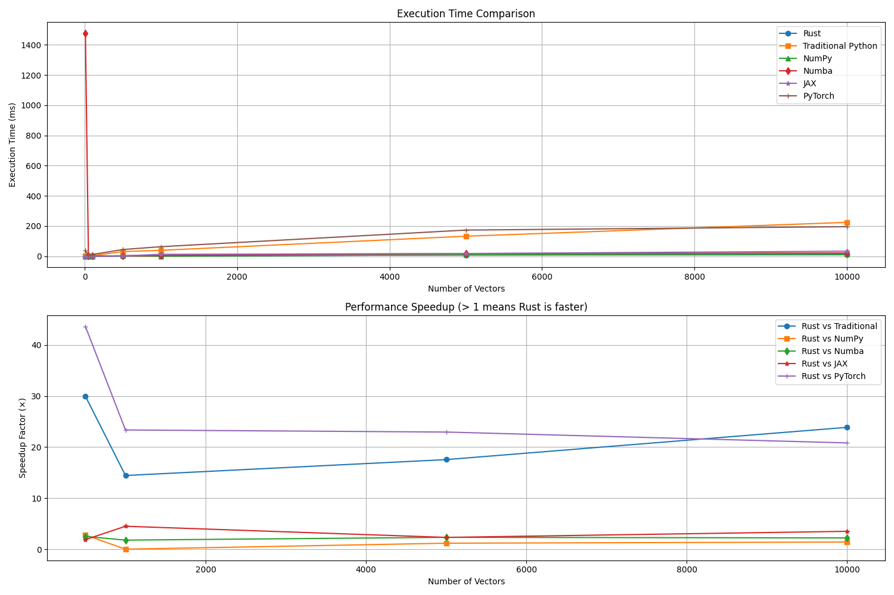

# Quantum Operations Benchmark Summary

**Date:** 2025-05-30 03:35:12

**Python Version:** 3.9.13

## Performance Results

| Vector Count | Rust (ms) | Traditional (ms) | NumPy (ms) | Numba (ms) | JAX (ms) | PyTorch (ms) |
|-------------|-----------|-----------------|------------|------------|----------|-------------|
| 10 | 0.00 | 0.18 | 0.00 | 1476.28 | 0.00 | 37.10 |
| 50 | 0.00 | 2.31 | 0.00 | 0.19 | 0.00 | 5.02 |
| 100 | 0.00 | 2.60 | 0.00 | 0.34 | 0.00 | 10.91 |
| 500 | 1.00 | 30.06 | 2.78 | 2.51 | 1.88 | 43.77 |
| 1000 | 2.68 | 38.69 | 0.00 | 4.76 | 12.04 | 62.59 |
| 5000 | 7.53 | 132.08 | 8.81 | 17.49 | 17.38 | 172.71 |
| 10000 | 9.38 | 223.87 | 13.14 | 20.68 | 32.82 | 195.28 |

## Speedup Relative to Rust

| Vector Count | Traditional | NumPy | Numba | JAX | PyTorch |
|-------------|------------|-------|-------|-----|--------|
| 10 | infx | infx | infx | infx | infx |
| 50 | infx | infx | infx | infx | infx |
| 100 | infx | infx | infx | infx | infx |
| 500 | 29.98x | 2.77x | 2.50x | 1.87x | 43.65x |
| 1000 | 14.44x | 0.00x | 1.78x | 4.49x | 23.36x |
| 5000 | 17.55x | 1.17x | 2.32x | 2.31x | 22.95x |
| 10000 | 23.87x | 1.40x | 2.21x | 3.50x | 20.82x |

