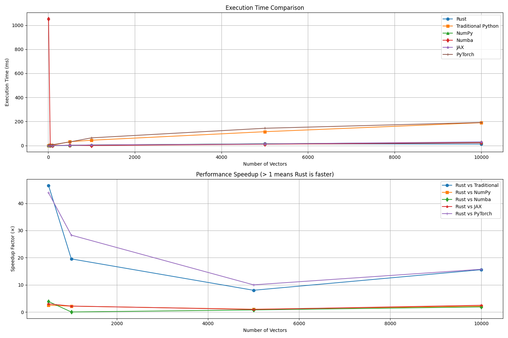

# Quantum Operations Benchmark Summary

**Date:** 2025-05-30 03:36:39

**Python Version:** 3.9.13

## Performance Results

| Vector Count | Rust (ms) | Traditional (ms) | NumPy (ms) | Numba (ms) | JAX (ms) | PyTorch (ms) |
|-------------|-----------|-----------------|------------|------------|----------|-------------|
| 10 | 0.00 | 0.00 | 0.67 | 1051.87 | 0.00 | 3.76 |
| 50 | 0.00 | 3.37 | 0.00 | 0.33 | 0.68 | 4.03 |
| 100 | 0.00 | 2.68 | 0.33 | 0.00 | 0.00 | 6.84 |
| 500 | 0.67 | 31.44 | 1.67 | 2.60 | 2.01 | 29.61 |
| 1000 | 2.25 | 43.93 | 4.82 | 0.00 | 4.89 | 63.61 |
| 5000 | 14.35 | 114.72 | 14.53 | 10.81 | 13.35 | 143.35 |
| 10000 | 12.17 | 189.54 | 26.04 | 22.65 | 30.09 | 191.55 |

## Speedup Relative to Rust

| Vector Count | Traditional | NumPy | Numba | JAX | PyTorch |
|-------------|------------|-------|-------|-----|--------|
| 10 | infx | infx | infx | infx | infx |
| 50 | infx | infx | infx | infx | infx |
| 100 | infx | infx | infx | infx | infx |
| 500 | 46.61x | 2.47x | 3.85x | 2.98x | 43.90x |
| 1000 | 19.55x | 2.14x | 0.00x | 2.18x | 28.30x |
| 5000 | 8.00x | 1.01x | 0.75x | 0.93x | 9.99x |
| 10000 | 15.57x | 2.14x | 1.86x | 2.47x | 15.74x |

