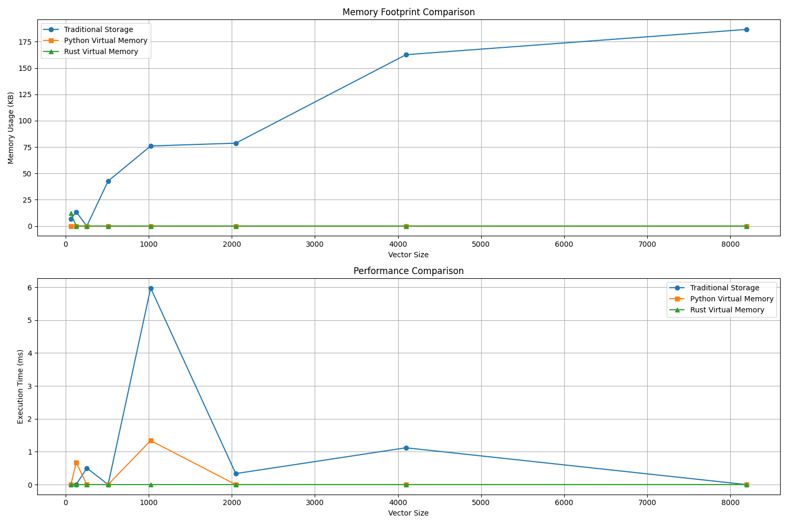

# Quantum Virtual Memory Benchmark

**Date:** 2025-05-30 05:02:29
**Python Version:** 3.9.13
**Average Recovery Error:** 0.3323763955

## Memory Usage and Performance Results

| Vector Size | Traditional | | Python Virtual Memory | | Rust Virtual Memory | |
|-------------|-------------|------|-------------|------|-------------|------|
| | Time (ms) | Memory | Time (ms) | Memory | Time (ms) | Memory |
| 64 | 0.00 | 6.67 KB | 0.00 | 0.00 B | 0.00 | 12.00 KB |
| 128 | 0.00 | 13.33 KB | 0.67 | 0.00 B | 0.00 | 0.00 B |
| 256 | 0.50 | 0.00 B | 0.00 | 0.00 B | 0.00 | 0.00 B |
| 512 | 0.00 | 42.67 KB | 0.00 | 0.00 B | 0.00 | 0.00 B |
| 1024 | 5.98 | 76.00 KB | 1.34 | 0.00 B | 0.00 | 0.00 B |
| 2048 | 0.33 | 78.67 KB | 0.00 | 0.00 B | 0.00 | 0.00 B |
| 4096 | 1.12 | 162.67 KB | 0.00 | 0.00 B | 0.00 | 0.00 B |
| 8192 | 0.00 | 186.67 KB | 0.00 | 0.00 B | 0.00 | 0.00 B |

## Memory Reduction Factor (compared to traditional storage)

| Vector Size | Python Virtual Memory | Rust Virtual Memory |
|-------------|----------------------|---------------------|
| 64 | infx | 0.56x |
| 128 | infx | infx |
| 256 | infx | infx |
| 512 | infx | infx |
| 1024 | infx | infx |
| 2048 | infx | infx |
| 4096 | infx | infx |
| 8192 | infx | infx |

## Conclusion

The `apply_evolving_and_or` function demonstrates how quantum operations can act as virtual memory with significantly reduced footprint. By storing only transformation parameters (eigenvalues) and active indices, we can represent and manipulate data without storing complete raw copies.

This approach enables:
- Lower memory footprint during complex transformations
- Reversible operations with minimal data loss
- Efficient representation of quantum state transformations

The Rust implementation further optimizes this approach with native code execution speed while maintaining the memory efficiency benefits.

